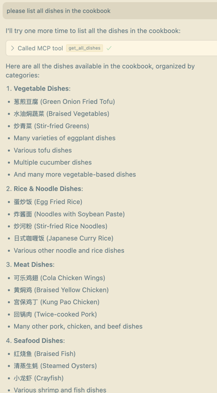
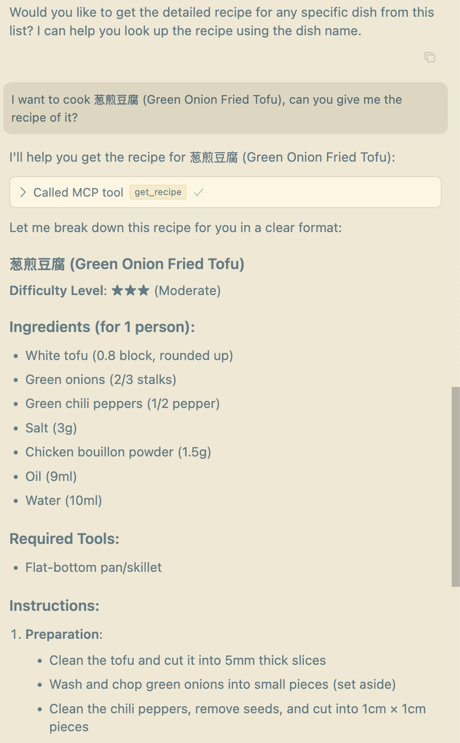

# cookbook-mcp-server

一个菜谱mcp server

支持工具：
- get_all_dishes：获取cookbook中的所有菜谱
- get_recipe：获取任意菜品的菜谱

## 环境配置
```bash
# Create a new directory for our project
uv init cookbook
cd cookbook

# Create virtual environment and activate it
uv venv
source .venv/bin/activate

# Install dependencies
uv add "mcp[cli]"
```

## 使用方法
1. 获取菜谱：
   菜谱：https://github.com/Anduin2017/HowToCook/tree/master
   ```bash
   git clone https://github.com/Anduin2017/HowToCook/tree/master
    ```
2. 替换cookbook.py中的cookbook路径。将1中clone下来的仓库的dishes文件夹路径填入下面常量
   ```python
   # Constants
   COOKBOOK_URL = "/PATH/OF/YOUR/COOKBOOK"
    ```
3. 配置mcp client。
   ```json
    {
      "mcpServers": {
        "cookbook": {
          "command": "/PATH/OF/uv",
          "args": [
            "--directory",
            "/PATH/OF/ROOT/mcp-server-cookbook/cookbook",
            "run",
            "/PATH/OF/ROOT/mcp-server-cookbook/cookbook.py"
          ]
        }
      }
    }
    ```
   
4. 如果使用sse server，需要进行一下修改
   - cookbook.py中修改执行入口
     ```python
     if __name__ == "__main__":
        # Initialize and run the server
        mcp.run(transport='sse')
     ```
   - mcp client配置修改。注意端口号。
     ```json
     {
      "mcpServers": {
        "cookbook": {
          "url": "http://localhost:PORT/sse"
        }
      }
     }
     ```

## cursor中效果截图


